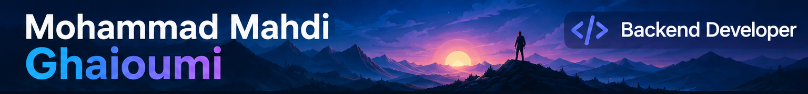

 

### *Curiosity writes the code. Perfection shapes it.*

---

## 👨‍💻 About Me

I'm a **Backend Developer** with a genuine passion for computers and programming.

I enjoy understanding how things work beneath the surface, exploring new ideas, and turning what I learn into something practical.

I'm always looking for something new to learn, build, and improve.

---

## ⚙️ Tech Stack

### 🐍 Backend & Data

  

### 🧰 Tools & Environment

  

&nbsp;

---

## 🌱 Currently Exploring

 

  

### Going deeper into Django & exploring Machine Learning.

---

## 💬 Let's Talk

 

**Have a question, an idea, or just want to talk about technology?**

Feel free to **ask me anything**, start a conversation, or open a discussion.

 

*I'm always happy to learn from others and share what I know.*

---

Always curious. Always building. Always improving.

